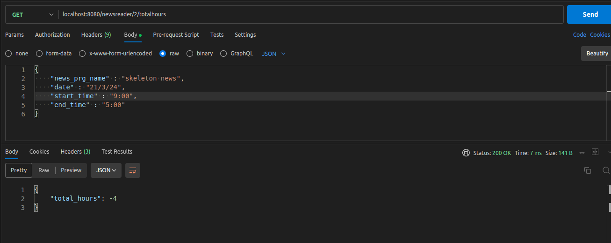

### News Channel Backend

This is a backend application for managing newsreader details and work schedules for a news channel. It provides endpoints for adding, updating, deleting, and viewing newsreader details, as well as adding work schedule details for each newsreader and displaying their total hours of work.

## Running Server

#### Endpoints:

1. **Add news reader details:**
   - Endpoint: `localhost:8080/newsreader`
   - Method: POST
   - Request Body: JSON object containing news reader details (e.g., name, email, phone number, designation, etc.)

2. **Update newsreader details:**
   - Endpoint: `localhost:8080/newsreader/{id}`
   - Method: PUT
   - Request Body: JSON object containing updated news reader details

3. **Delete newsreader details:**
   - Endpoint: `localhost:8080/newsreader/{id}`
   - Method: DELETE
   - Path Parameter: ID of the news reader to be deleted

4. **View all newsreader details:**
   - Endpoint: `localhost:8080/newsreaders`
   - Method: GET
   - Response: JSON array containing all news reader details

5. **Add work schedule details for a newsreader:**
   - Endpoint: `localhost:8080/newsreader/{id}/workschedule`
   - Method: POST
   - Path Parameter: ID of the news reader
   - Request Body: JSON object containing work schedule details (e.g., news_prg_name, date, start time, end time)

6. **Display the total hours of work for a news reader:**
   - Endpoint: `localhost:8080/newsreader/{id}/totalhours`
   - Method: GET
   - Path Parameter: ID of the news reader
   - Response: JSON object containing total hours worked by the news reader

#### Models:

- **NewsReader:**
  - Attributes: Name, Age, phone, designation, etc.

- **WorkSchedule:**
  - Attributes: News Program Name, Date, Start Time, End Time

#### GitHub Repository:

The code for this project is available on GitHub: [News Channel Backend Repository](https://github.com/tusuii/GoLang_WebServer_Mediater_Task/)

#### Testing:

Please find the testing video of the endpoints [here](https://drive.google.com/file/d/1e8tXaxsThdRE8cElHr2O9dVsPhrl-wGd/view?usp=drive_link)

For any further information or issues, please contact [Twitter](https://twitter.com/SubodhKamble42).
